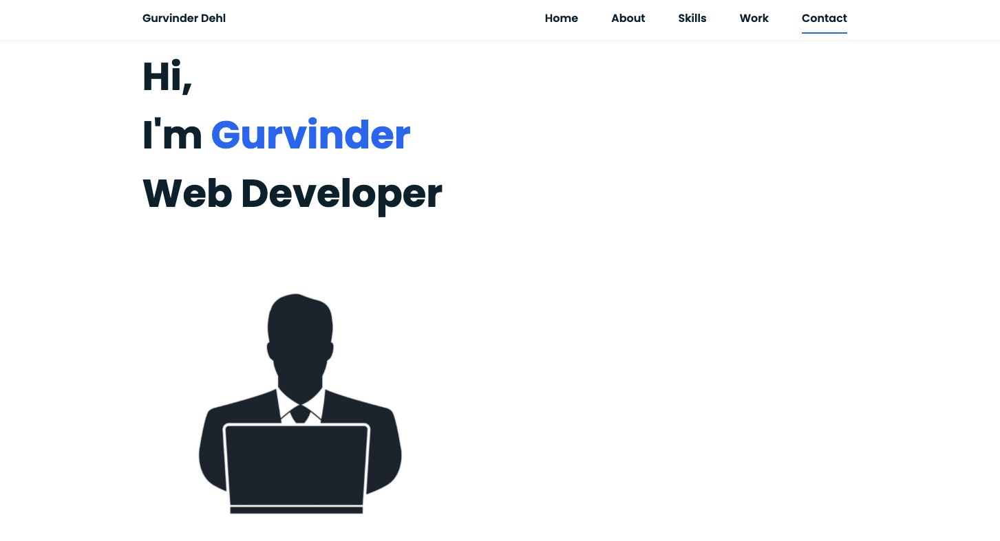

# Homework-Responsive-Portifolio-Redesign

Table of content :

1. The purpose
2. The method
3. HTML file
4. Demonstration
5. URLs 

-----------------------------------------------------------------------------------------------------------------------

## 1. The purpose :

The main purpose of this assignment is create a responsive personal portifolio, with links to my Github, Linked In and CV. The assignment should have a mobile first responsive design, as well as being up to date with the various skills I possess. It should also display my contact information and a previous projects I have completed. The whole point of this was to demonstrate to a future employer what I am capable of doing, when given a task to complete.

-----------------------------------------------------------------------------------------------------------------------

## 2. The method : 

    This website is created using the following languages and softwares.

    * HTML file : index.html.
    * Javascript file: index.js
    * Styling File: style.css
    * VS Code
    * Github
   
-----------------------------------------------------------------------------------------------------------------------

## 3. HTML file : 
    
    This file is created according to the standards.

    * Using sementics
    * Using consistently indentation and spacing
    * Using links to link the HTML file to other files (script and style files)
    * Commenting the code

-----------------------------------------------------------------------------------------------------------------------

## 4. Demonstration :  

-----------------------------------------------------------------------------------------------------------------------

## 5. URLs 

* The URL of the deployed application : https://gurvinderdehl.github.io/Homework-7-Responsive-Portifolio-Redesign/

* The URL of the GitHub repository: https://github.com/gurvinderdehl/Homework-7-Responsive-Portifolio-Redesign
-----------------------------------------------------------------------------------------------------------------------